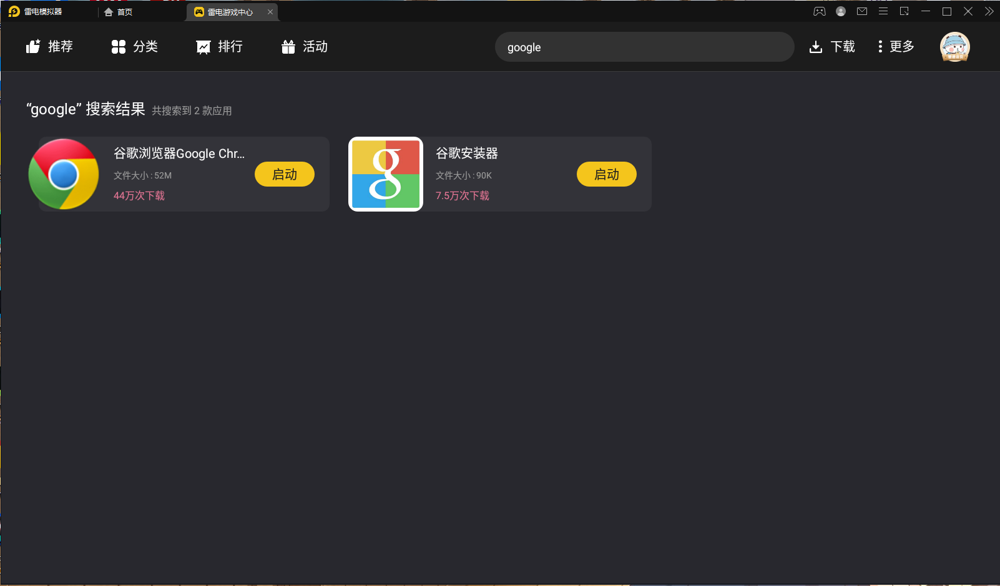
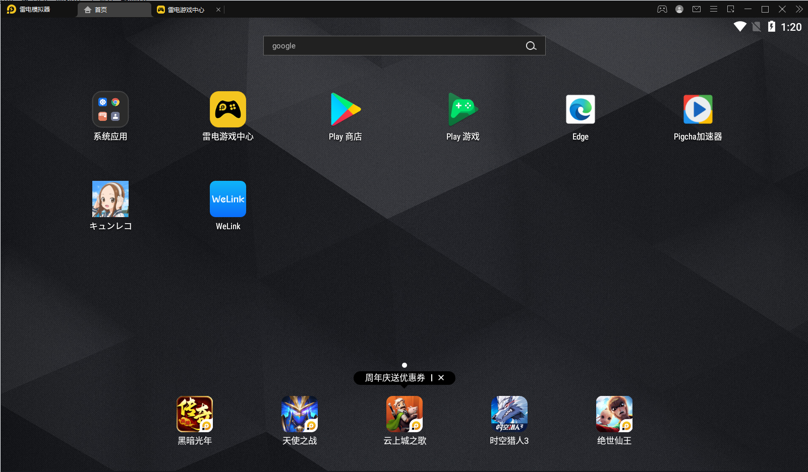
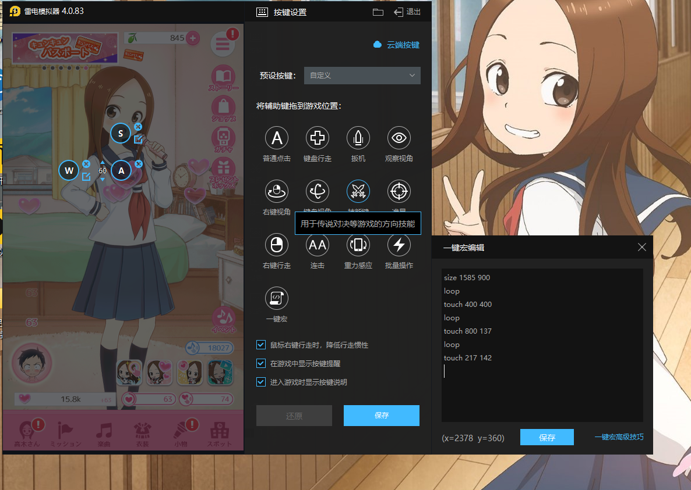
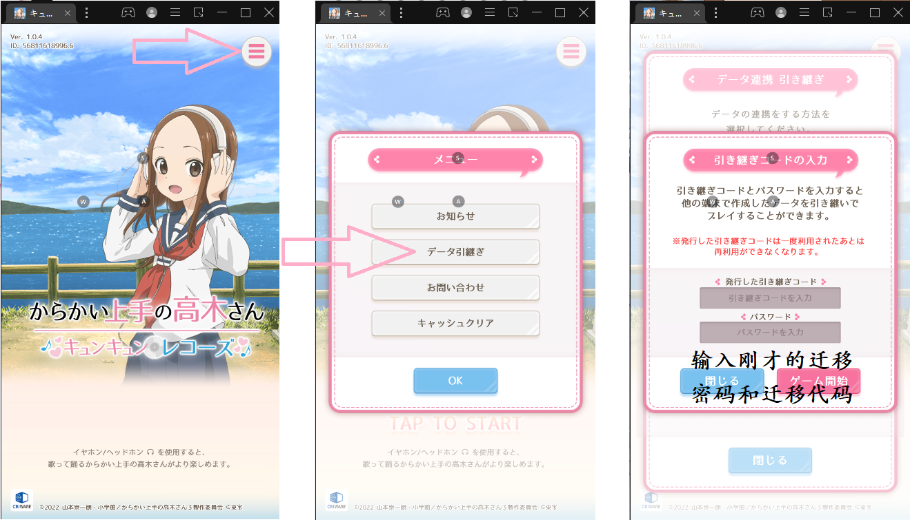

# 《擅长捉弄的高木同学 心跳记录》安装教程

[TOC]

## 游戏介绍

​		《擅长捉弄的高木同学 心跳纪录》是以人气动画《擅长捉弄的高木同学》为改编的初恋点击手游。游戏故事讲述老是被坐在隔壁的高木同学捉弄的男国中生西片，下定决心“今天一定要取笑高木同学让她害羞！”，没想到高木竟然宣布要参加町内会所举办的卡拉OK比赛！？
​		玩家将通过点击，将“爱心”赠送给练习歌唱的高木同学，为两人的初恋助力！随着收集的“爱心”越多，高木同学的歌唱水准也会提升，将可解锁新的故事及歌曲。音乐可设定为高木同学所演唱的歌曲或纯乐器演奏的乐器版，就算重复播放歌曲时放置游戏，也能一直累积爱心。


## 安装方法

​		安装的平台可以在安卓手机/苹果iPhone手机/iPad平板/Windows 电脑的安卓模拟器上进行，经过测试都可以正常的进行游戏。当然，要玩这个游戏必备的工具是一个加速器，推荐使用[猎豹加速器](http://www.lbjiasu89.com/)或者[Pigcha加速器](http://www.pigcha.com/)（可以自行百度搜索或者单机链接），如果您要使用连点器，可以加速游戏，但是不确定是否会被封号。本文也会附带使用连点器的方法。

### 在iPhone或iPad上安装

#### 日区Apple ID

​		在下载这个游戏之前，你需要一个日区的苹果ID账号。如果你已经有的话请看下一节，没有的话请按照下面的步骤申请。

1. 单机这里的链接，申请一个日区的Apple ID 账户：[Apple IDを作成 - Apple (日本)](https://appleid.apple.com/account)

2. 参考教程注册：[外区AppleID注册教程](https://zhuanlan.zhihu.com/p/133273790)

3. 注意：“**国家或地区**”这一栏必须要填写对应的区域（如下图所示）
   

4. 电话号码**一定要填写自己的真实电话号码，+86必选**，不要乱填奥；邮箱填一个自己没有用于Apple服务的，或者自己注册一个全新的邮箱，比如之前有163的邮箱现在可以去申请一个126（不过我感觉一般人应该都有2个或者多个邮箱吧）
   

   

5. 然后在手机的应用商店退出旧账户，登录新账户（日区）

   

6. 登录账户，可能会有一个要输入付款方式、账单的地址的页面，可以直接随便输入，只要格式符合，都能成功登录。
   

#### 搜索并下载安装

1. 搜索关键词“高木”，没错，汉字就可以。

2. 单机“入手”，即可下载，类似其他的App正常安装即可。
   

3. 畅玩吧~

### 在安卓手机上安装

- 如果你的手机是华为系列的，比如是鸿蒙系统的，由于没有Google框架，直接下载非常困难。（如果你已经安装好了正常可用的Google框架，有Google应用商店，可以直接搜索然后安装）哪怕从某些网站得到了下载的安装包，安装之后，游戏也不能更新，也无法登录到Google账号保存游戏进度，所以不建议用这种方法，推荐使用电脑的安卓模拟器进行。
- 如果你的手机有谷歌框架，那么只需要科学联网，即可在Google商店中搜索到。
- 如果你不清楚是否有谷歌框架，那么请直接使用电脑安卓模拟器安装。

### 在电脑的安卓模拟器安装

- 安卓模拟器推荐使用：[雷电安卓模拟器](https://www.ldmnq.com/)
- 该模拟器支持编程式的连点器，可以自由搭配点击次数，点击时间等
- [雷电模拟器卡50%不能运行的解决方法](https://zhidao.baidu.com/question/440808738036291284.html)

#### 安装雷电模拟器

- 在官网下载雷电安卓模拟器的安装包
- 按照正常的方法安装应用程序
- 然后打开程序：雷电安卓模拟器
- 如果出现问题，卡死，请参考官网的提示，此外卡死50%请参考上面超链接的解决办法

#### 安装Google框架

- 如下如图所示，搜索google即可
- 然后在谷歌安装器点“安装”即可，由于我已经安装好了，所以这里是“启动”



- 安装你的加速器软件，将加速器的apk安装包的文件直接拖动到应用程序里面就可以自动安装，安装后打开登录，科学连接网络即可。

#### 安装游戏

- 在你完成上一步后，应该有下面的两个图标在首页


下图是我已经全部安装好的页面，仅用作展示而已。



打开浏览器（没有的话安装一个Chrome），输入网址：https://takagi3game.jp/，进入下面的页面（要科学上网先）


点击Google Play，就可以打开自己的谷歌商店然后安装下载了！当然，你还需要有一个Google账号，这个注册就不多叙述了。我后来测试发现直接在谷歌商店好像搜不到这款App。不知道是不是锁区了缘故。

安装完成就是下面的结果：


## 玩法简介

### 绑定账号

​		简而言之，就是用手狂戳屏幕，然后积攒爱心。爱心可以用来升级一些游戏任务/物件/场景，此外，这个游戏可以当作一个听歌的软件。里面的音乐也不需要付费。

​		第一次进入游戏如果只单机页面，就会需要同意一个规约，然后就会创建一个你自己的账号。（同意的按钮都在右边）但是这个账号没有绑定任何第三方的登录账号，就会很危险，一旦卸载游戏，进度就找不回来了。


​		进入游戏后单击三条杠，单击通过Google登录，即可保存进度了。


​	

### 页面简介

- 底栏的第一栏的是人物和技能（比如延长某些时间、增加单次点击获得的爱心）
- 底栏的第二栏的是任务和奖励（每日任务，类比原神的今日委托）
- 底栏的第三栏的是音乐（可以用来切换高木唱的歌）
- 底栏的第四栏的是衣着（用来更换衣服）
- 底栏的第五栏的是挂件配饰（手上拿的东西、环境摆放的）
- 底栏的第六栏的是更换背景环境（比如卧室、教室等）


- 左上方的轮播是最近的卡池信息，可以抽卡
- 上方绿色的形似豌豆叶片的是游戏币（或者类比原石）可以用来抽卡
- 靠右的一系列按钮中，三条杠的是游戏配置选项
- 靠右的一系列按钮中，书籍样式的是剧情
- 靠右的一系列按钮中，购物袋样式的是商店，可以买游戏道具之类的（我目前还没有买过）
- 四个高木带爱心的图标是技能，可以用来加倍每次点击的爱心收获值。
- 按钮基本看样子和文字能猜出一二，所以不是很难，就不多说啦

### 抽卡简介

- 抽卡可以获得人物，高木的衣装，还有手上拿的东西，背景，背景装饰的物。
- 每次抽卡消耗绿色叶片300，十连发消耗3000，不存在价差。
- 看一下卡池的海报就可以知道卡池的内容。

### 连点器

- 单击模拟器的按钮：“按键”


- 参考下图配置

- 宏编程的代码如下：

- ```
  size 1585 900
  loop
  touch 400 400
  loop
  touch 800 137
  loop
  touch 217 142
  ```

- 具体说来，就是先要点击一键宏，然后编辑一键宏的代码，代码如上，然后设置这个代码宏的按键（比如我设置的就是S）然后返回主页面，按对应的按键就可以实现效果！




### 账号迁移

- 账户迁移适用于把游戏进度从一个手机迁移到另外一个手机上。根据我的尝试，游戏不能同时在两个设备上进行，就是说，只能有一台终端设备在线游戏。
- 要迁移账号请按照下图操作


- 输入迁移密码（需要十位，字符和数字组合）两个输入框分别是密码和确认密码，输入一样就好


- 然后单击红色的按钮，进行下一步，游戏会弹出一个对话框，对话框中是迁移的一次性代码。这个代码只能使用一次，用完作废。
- 到要迁移的目标新设备上打开游戏，按照下面的流程操作。



## 常见问题

### 账户相关

1. 游戏的进度是如何保存的？

   答：应该是保存在服务器后台（端），但是不能通过用户名和密码直接登录账号，只能通过AppleID【登录最近好像有点问题，苹果系列的】或者Google账号【这个正常的目前】登录，再或者迁移游戏进度。

2. 什么是迁移游戏进度？

   答：将游戏登录的令牌许可从一个设备迁移到另外一个设备，同时将资源素材（游戏的音乐，背景环境等）下载到另外的一个设备。在一段时间内，游戏仅允许一台设备使用登录游戏，也就是说，我如果早上在手机上玩了这个游戏，然后中午在iPad上想接着玩，需要经过游戏进度的迁移，且迁移之后，手机上就无法登陆进行游戏了。（这个设定好离谱）

3. 卸载游戏后进度是否还在？

   答：如果没有关联任何的Google账号或者AppleID，进度将会丢失，可能需要联系游戏官方人员恢复。因为游戏是不能通过用户名密码直接登录的，只能通过一次性的迁移代码（而这个迁移代码必须要登录后设置迁移密码后才能获得），所以不要轻易卸载游戏，否则可能丢失所有进度的。

4. 我的账号的UID在哪？

   答：游戏首页的左上角，形如`XXXX.X`的就是你的UID，如果有问题可能需要提供UID联系官方。

5. 绑定Apple ID的时候如何才能知道成功了？

   答：如果没有反应，或者提示报错代码的现象，都是没有绑定成功的，只有提示了“XXX成功”，才是绑定完成。似乎国内的网络不能直接绑，需要科学上网。请根据实际情况决定。如果不确定是否绑定成功，可以多尝试几次，如果出现提示需要解绑，那就是说明绑定成功了。

6. 一个游戏内的账号能不能绑定多个AppleID

   答：经过测试，不能。会提示解绑旧的账户，然后才能关联新的账户。

7. 如何重开（删除所有的游戏进度）

   答：操作前请谨慎，这个操作属于删除账号。

   

### 游戏相关

1. 游戏中如何切换新的音乐？

   答：底栏中进入歌曲，然后选择目标歌曲，可能需要先单击下载，再点击歌曲才可以播放。

2. 服装，背景环境如何获得？

   答：通过抽卡或者某些活动任务获得。

3. 氪金在哪里进行？

   答：iOS用户通过苹果商店支付，安卓用户通过Google商店支付。

4. 是否值得氪金？

   答：不推荐。玩玩乐呵就好，而且好多服装抽中概率本身就很低，如果还想要高等级难度更大，类比原神的人物命星，请理性消费。

5. 服装、某些人物角色的升级是什么？有什么用？

   答：多次抽卡抽到同一个服装就会升级，据说升级后形态会有一定的变化。

6. 为什么感觉抽卡动画如此拙劣？就像是动画里面截屏的？

   答：自信点，把像去掉，就是截的，和原神那种抽卡动画虽然是不能比的，还是就凑合玩一下。

7. 看不懂日语剧情怎么办？

   答：截屏，然后微信翻译即可。

8. 游戏是否适配iPad分辨率？

   答：不适配，横屏左右都是大黑框，适配不太好，只能当一个手游玩一下。


### 连点器相关

1. 官方是否允许连点器？

   答：目前没有说明，不确定使用连点器是否会被封号。


